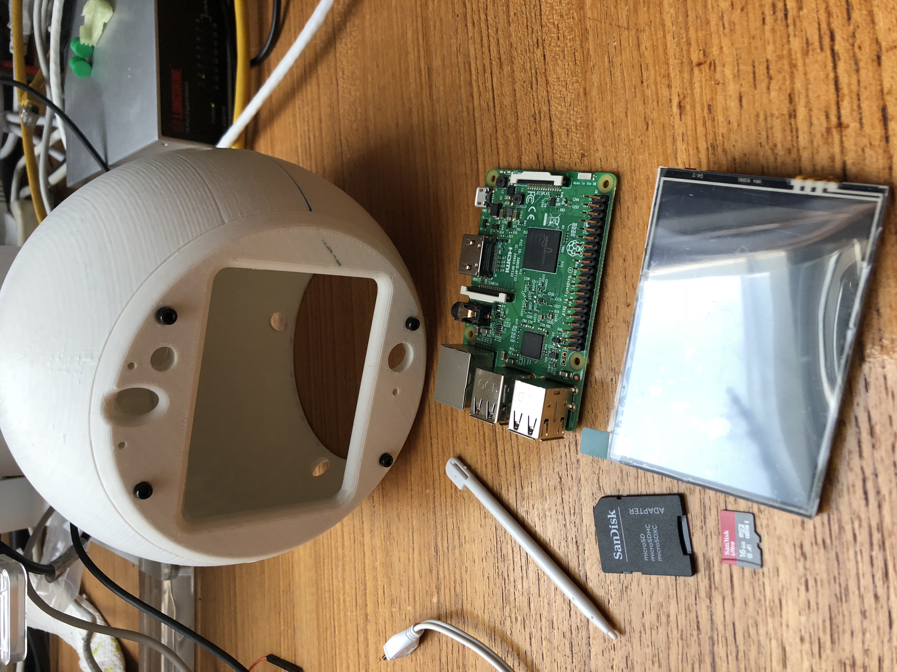

## First Steps
# Let's get it started
As a first step, I printed the CIMON Design from Thingiverse with a scaling of 50% for all axes.

# Raspberry
Then I took a Raspberry Pi 3 and added a 3.5" GPIO Touch Display to it.

# Installation Steps
In very short, this is what I did so far:
- install latest raspbian
- enable ssh -> in boot Partition: touch ssh
- sudo raspi-config
- sudo apt-get update
- sudo apt-get upgrade

For my display, followed: https://github.com/goodtft/LCD-show
-	sudo rm -rf LCD-show
-	git clone https://github.com/goodtft/LCD-show.git
-	chmod -R 755 LCD-show
-	cd LCD-show/
-	sudo ./LCD35-show

Touch Rotation:	
-	sudo nano /etc/X11/xorg.conf.d/99-calibration.conf
-	add: Option "TransformationMatrix" "0 -1 1 1 0 0 0 0 1"
	
Calibrate Touch...
	https://github.com/notro/fbtft/issues/445

Install Virtual Keyboard:
	http://ozzmaker.com/virtual-keyboard-for-the-raspberry-pi/

- sudo apt-get install libfakekey-dev libpng-dev libxft-dev autoconf libtool -y
- git clone https://github.com/mwilliams03/matchbox-keyboard.git
- cd matchbox-keyboard
- ./autogen.sh
- make
- sudo make install
- sudo apt-get install libmatchbox1 -y
